---
lab:
    title: '서버리스 SQL 풀을 사용하여 대화형 쿼리 실행'
    module: '모듈 2'
---

# 랩 2 - 서버리스 SQL 풀을 사용하여 대화형 쿼리 실행

이 랩에서는 데이터 레이크 및 외부 파일 원본에 저장된 파일을 사용하는 방법을 알아봅니다. 이 과정에서 Azure Synapse Analytics의 서버리스 SQL 풀이 실행하는 T-SQL 문을 사용합니다. 그리고 데이터 레이크에 저장된 Parquet 파일 및 외부 데이터 저장소에 저장된 CSV 파일을 쿼리합니다. 그런 후에는 Azure Active Directory 보안 그룹을 만들고, RBAC(역할 기반 액세스 제어) 및 ACL(액세스 제어 목록)을 통해 데이터 레이크의 파일에 대한 액세스 권한을 적용합니다.

이 랩을 마치면 다음과 같은 역량을 갖추게 됩니다.

- 서버리스 SQL 풀을 사용하여 Parquet 데이터 쿼리
- Parquet 및 CSV 파일용 외부 테이블 만들기
- 서버리스 SQL 풀을 사용하여 뷰 만들기
- 서버리스 SQL 풀 사용 시 데이터 레이크의 데이터 액세스 보호
- RBAC(역할 기반 액세스 제어) 및 ACL(액세스 제어 목록)을 사용하여 데이터 레이크 보안 구성

## 랩 설정 및 필수 구성 요소

이 랩을 시작하기 전에 랩 환경을 만드는 설정 단계를 성공적으로 완료했는지 확인하세요.

## 연습 1: Azure Synapse Analytics에서 서버리스 SQL 풀을 사용하여 Data Lake Store 쿼리

오늘날의 데이터 엔지니어와 데이터 과학자가 수행해야 하는 가장 중요한 작업 중 하나는 데이터를 탐색하여 파악하는 것입니다. 데이터의 기본 구조와 탐색 프로세스의 구체적인 요구 사항에 따라 성능과 복잡성, 활용 범위가 각기 다른 데이터 처리 엔진을 사용해야 합니다.

Azure Synapse Analytics에서는 SQL 또는 Apache Spark for Synapse 중 한 가지를 사용할 수도 있고 두 가지를 모두 사용할 수도 있습니다. 개인 기본 설정 및 전문 지식 수준에 따라 주로 사용하는 서비스가 결정됩니다. 데이터 엔지니어링 작업을 수행할 때는 두 가지 옵션을 모두 사용할 수 있는 경우가 많습니다. 그러나 Apache Spark의 기능을 활용하면 원본 데이터의 문제를 해결할 수 있는 상황도 있습니다. Synapse Notebook에서는 다양한 무료 라이브러리를 가져올 수 있기 때문입니다. 이러한 라이브러리는 데이터 사용 시 환경에 기능을 추가로 제공합니다. 반면 서버리스 SQL 풀을 사용하여 데이터를 탐색하거나, Power BI 등의 외부 도구에서 액세스 가능한 SQL 뷰를 통해 데이터 레이크의 데이터를 표시하는 방식이 훨씬 편리하며 속도도 빠른 상황도 있습니다.

이 연습에서는 두 옵션을 모두 사용하여 데이터 레이크를 살펴봅니다.

### 작업 1: 서버리스 SQL 풀을 사용하여 영업 Parquet 데이터 쿼리

서버리스 SQL 풀을 사용하여 Parquet 파일을 쿼리할 때는 T-SQL 구문을 사용하여 데이터를 탐색할 수 있습니다.

1. Synapse Studio(<https://web.azuresynapse.net/>)를 열고 **데이터** 허브로 이동합니다.

    

2. 왼쪽 창의 **연결됨** 탭에서 **Azure Data Lake Storage Gen2**와 **asaworkspace*xxxxxx*** 기본 ADLS Gen2 계정을 확장하고 **wwi-02** 컨테이너를 선택합니다.
3. **sale-small/Year=2019/Quarter=Q4/Month=12/Day=20191231** 폴더에서 **sale-small-20191231-snappy.parquet** 파일을 마우스 오른쪽 단추로 클릭하고, **새 SQL 스크립트**를 선택한 후에 **상위 100개 행 선택**을 선택합니다.

    

3. 쿼리 창 위쪽의 **연결 대상** 드롭다운 목록에서 **기본 제공**이 선택되어 있는지 확인하고 쿼리를 실행합니다. 서버리스 SQL 엔드포인트에서 데이터가 로드되어 일반 관계형 데이터베이스의 데이터처럼 처리됩니다.

    

    셀 출력에 Parquet 파일의 쿼리 결과가 표시됩니다.

    

4. 데이터를 더욱 정확하게 파악하기 위해 SQL 쿼리를 수정하여 집계 및 그룹화 작업을 수행합니다. 쿼리를 다음과 같이 바꿉니다. *SUFFIX*를 Azure Data Lake Store의 고유한 접미사로 바꾸고, OPENROWSET 함수의 파일 경로가 현재 파일 경로와 일치하는지 확인합니다.

    ```sql
    SELECT
        TransactionDate, ProductId,
            CAST(SUM(ProfitAmount) AS decimal(18,2)) AS [(sum) Profit],
            CAST(AVG(ProfitAmount) AS decimal(18,2)) AS [(avg) Profit],
            SUM(Quantity) AS [(sum) Quantity]
    FROM
        OPENROWSET(
            BULK 'https://asadatalakeSUFFIX.dfs.core.windows.net/wwi-02/sale-small/Year=2019/Quarter=Q4/Month=12/Day=20191231/sale-small-20191231-snappy.parquet',
            FORMAT='PARQUET'
        ) AS [r] GROUP BY r.TransactionDate, r.ProductId;
    ```

    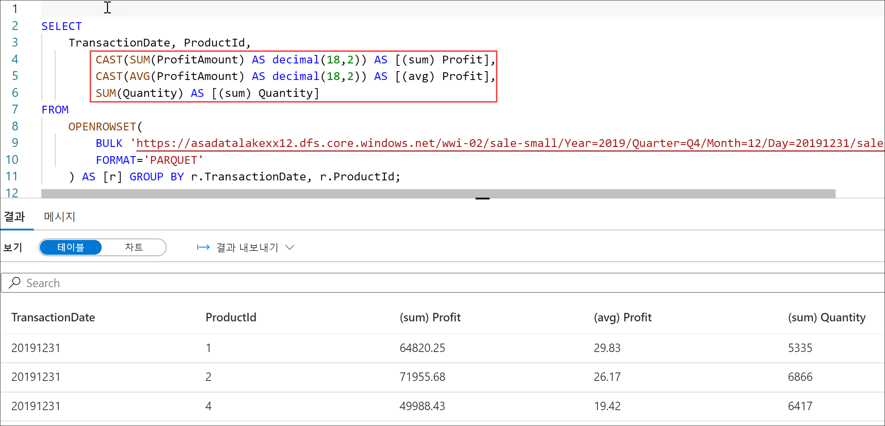

5. 이번에는 2019년의 파일 하나가 아닌 최신 데이터 집합을 확인해 보겠습니다. 구체적으로는 2019년 전체 데이터가 들어 있는 Parquet 파일 내에 포함된 레코드 수를 확인해 보겠습니다. Azure Synapse Analytics로 데이터를 가져오는 과정을 최적화할 방법을 계획하려면 이 정보를 반드시 확인해야 합니다. 이 확인 작업을 위해 쿼리를 다음 코드로 바꿉니다(BULK 문의 데이터 레이크 접미사를 업데이트해야 함).

    ```sql
    SELECT
        COUNT(*)
    FROM
        OPENROWSET(
            BULK 'https://asadatalakeSUFFIX.dfs.core.windows.net/wwi-02/sale-small/Year=2019/*/*/*/*',
            FORMAT='PARQUET'
        ) AS [r];
    ```

    > 위의 코드에서는 *sale-small/Year=2019*의 모든 하위 폴더에 있는 Parquet 파일이 모두 포함되도록 경로를 업데이트했습니다.

    이 코드를 실행하면 레코드 **4124857**개가 출력되어야 합니다.

### 작업 2: 2019년 영업 데이터용 외부 테이블 만들기

Parquet 파일을 쿼리할 때마다 OPENROWSET 및 루트 2019 폴더가 포함된 스크립트를 작성하지 않고 외부 테이블을 만들 수도 있습니다.

1. Synapse Studio에서 **wwi-02** 탭으로 돌아가면 *sale-small/Year=2019/Quarter=Q4/Month=12/Day=20191231* 폴더의 콘텐츠가 여전히 표시되어 있습니다.
2. **sale-small-20191231-snappy.parquet** 파일을 마우스 오른쪽 단추로 클릭하고 **새 SQL 스크립트**, **외부 테이블 만들기**를 차례로 선택합니다. 새 외부 테이블 대화 상자에서 **계속**을 클릭합니다.
3. **SQP 풀**에서 **기본 제공**이 선택되어 있는지 확인합니다. 그런 다음에 **데이터베이스 선택** 아래에서 **+ 새로 만들기**를 선택하고 `demo`라는 데이터베이스를 만들고 **만들기**를 클릭합니다. **외부 테이블 이름**에는 `All2019Sales`를 입력합니다. 마지막으로, **외부 테이블 만들기** 아래에서 **SQL 스크립트 사용**이 선택되었는지 확인한 후에 **스크립트 열기**를 선택하여 SQL 스크립트를 생성합니다.

    

    > **참고**: 스크립트의 **속성** 창은 자동으로 열립니다. 오른쪽 상단에 있는 **속성** 단추를 사용하여 닫으면 스크립트를 작업하는 것이 좀더 편해집니다.

    생성된 스크립트에 포함된 구성 요소는 다음과 같습니다.

    - **1)** 이 스크립트는 먼저 *FORMAT_TYPE*이 *PARQUET*인 *SynapseParquetFormat* 외부 파일 형식을 만듭니다.
    - **2)** 그리고 나면 데이터 레이크 스토리지 계정의 *wwi-02* 컨테이너를 가리키는 외부 데이터 원본이 작성됩니다.
    - **3)** CREATE EXTERNAL TABLE WITH 문은 파일 위치를 지정하며, 위에서 만든 새 외부 파일 형식과 데이터 원본을 참조합니다.
    - **4)** 마지막으로 `2019Sales` 외부 테이블에서 상위 결과 100개를 선택합니다.
    
4 CREATE EXTERNAL TABLE 문의 **[TransactionId] varchar(8000)** 행에서 8000을 4000으로 변경하고, `COLLATE Latin1_General_100_BIN2_UTF8`를 추가하고, *위치* 값을 `sale-small/Year=2019/*/*/*/*.parquet`으로 바꿔서 이 문이 다음과 비슷해지도록 합니다(고유 리소스 접미사 제외).

```sql
CREATE EXTERNAL TABLE All2019Sales (
    [TransactionId] varchar(8000) COLLATE Latin1_General_100_BIN2_UTF8,
    [CustomerId] int,
    [ProductId] smallint,
    [Quantity] smallint,
    [Price] numeric(38,18),
    [TotalAmount] numeric(38,18),  
    [TransactionDate] int,
    [ProfitAmount] numeric(38,18),
    [Hour] smallint,
    [Minute] smallint,
    [StoreId] smallint
    )
    WITH (
    LOCATION = 'sale-small/Year=2019/*/*/*/*.parquet',
    DATA_SOURCE = [wwi-02_asadatalakeSUFFIX_dfs_core_windows_net],
    FILE_FORMAT = [SynapseParquetFormat]
    )
GO
```

5. 스크립트가 서버리스 SQL 풀(**기본 제공**)에 연결되었고 **데이터베이스 사용** 목록에서 **demo** 데이터베이스가 선택되었는지 확인합니다. (창을 표시하기에 너무 작은 경우에는 **[...]** 단추를 사용하고, 필요하면 &#8635; 단추를 사용하여 목록을 새로 고칩니다.)

    

6. 수정된 스크립트를 실행합니다.

    스크립트를 실행하고 나면 **All2019Sales** 외부 테이블을 대상으로 실행된 SELECT 쿼리의 출력을 확인할 수 있습니다. 이 출력에는 *YEAR=2019* 폴더에 있는 Parquet 파일의 첫 100개 레코드가 표시됩니다.

    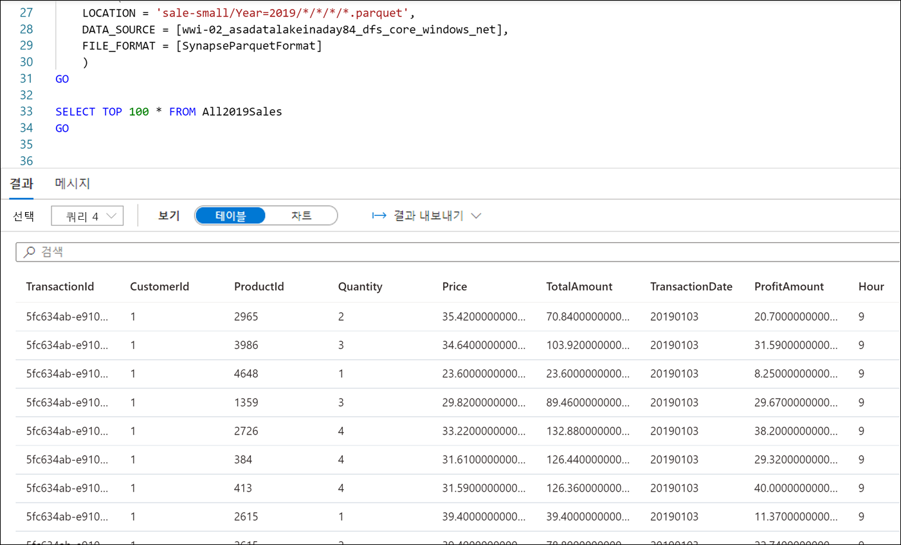

    > **팁**: 코드에 실수가 있어서 오류가 발생하는 경우에는 성공적으로 생성된 리소스를 모두 삭제한 후에 다시 시도해야 합니다. 적절한 DROP 문을 실행하거나 **작업 영역** 탭으로 전환하고, **데이터베이스** 목록을 새로 고치고, **demo** 데이터베이스에서 개체를 삭제하면 됩니다.

### 작업 3: CSV 파일용 외부 테이블 만들기

Tailwind Traders는 사내에서 사용하려는 국가 인구 데이터용 공개 데이터 원본을 찾았습니다. 그런데 해당 데이터 원본은 향후 예상 인구 수를 반영하여 정기적으로 업데이트되므로, 데이터를 단순히 복사만 해서는 안 됩니다.

그래서 외부 데이터 원본에 연결하는 외부 테이블을 만들기로 했습니다.

1. 이전 작업에서 실행한 SQL 스크립트를 다음 코드로 바꿉니다.

    ```sql
    IF NOT EXISTS (SELECT * FROM sys.symmetric_keys) BEGIN
        declare @pasword nvarchar(400) = CAST(newid() as VARCHAR(400));
        EXEC('CREATE MASTER KEY ENCRYPTION BY PASSWORD = ''' + @pasword + '''')
    END

    CREATE DATABASE SCOPED CREDENTIAL [sqlondemand]
    WITH IDENTITY='SHARED ACCESS SIGNATURE',  
    SECRET = 'sv=2018-03-28&ss=bf&srt=sco&sp=rl&st=2019-10-14T12%3A10%3A25Z&se=2061-12-31T12%3A10%3A00Z&sig=KlSU2ullCscyTS0An0nozEpo4tO5JAgGBvw%2FJX2lguw%3D'
    GO

    -- Create external data source secured using credential
    CREATE EXTERNAL DATA SOURCE SqlOnDemandDemo WITH (
        LOCATION = 'https://sqlondemandstorage.blob.core.windows.net',
        CREDENTIAL = sqlondemand
    );
    GO

    CREATE EXTERNAL FILE FORMAT QuotedCsvWithHeader
    WITH (  
        FORMAT_TYPE = DELIMITEDTEXT,
        FORMAT_OPTIONS (
            FIELD_TERMINATOR = ',',
            STRING_DELIMITER = '"',
            FIRST_ROW = 2
        )
    );
    GO

    CREATE EXTERNAL TABLE [population]
    (
        [country_code] VARCHAR (5) COLLATE Latin1_General_BIN2,
        [country_name] VARCHAR (100) COLLATE Latin1_General_BIN2,
        [year] smallint,
        [population] bigint
    )
    WITH (
        LOCATION = 'csv/population/population.csv',
        DATA_SOURCE = SqlOnDemandDemo,
        FILE_FORMAT = QuotedCsvWithHeader
    );
    GO
    ```

    스크립트 윗부분에는 임의 암호를 사용하여 MASTER KEY를 만드는 코드가 있습니다. 그 다음 코드에서는 위임된 액세스용 SAS(공유 액세스 서명)를 사용하여 외부 스토리지 계정의 컨테이너용으로 데이터베이스 범위 자격 증명을 만듭니다. 인구 데이터가 포함된 외부 스토리지 계정 위치를 가리키는 **SqlOnDemandDemo** 외부 데이터 원본을 만들 때 이 자격 증명을 사용합니다.

    

    > 데이터베이스 범위 자격 증명은 보안 주체가 DATA_SOURCE를 사용하여 OPENROWSET 함수를 호출하거나, 공용 파일에 액세스하지 않는 외부 테이블에서 데이터를 선택할 때 사용됩니다. 데이터베이스 범위 자격 증명은 스토리지 계정 이름과 일치하지 않아도 됩니다. 스토리지 위치를 정의하는 DATA SOURCE에서 명시적으로 사용되기 때문입니다.

    스크립트의 다음 부분에서는 외부 파일 형식 **QuotedCsvWithHeader**를 만듭니다. 외부 파일 형식 만들기는 외부 테이블을 만들기 위한 필수 구성 요소입니다. 외부 파일 형식을 만들어 외부 테이블에서 참조하는 데이터의 실제 레이아웃을 지정하게 됩니다. 여기서는 CSV 파일 종결자(문자열 구분 기호)를 지정합니다. 또한 파일에 헤더 행이 포함되어 있으므로 FIRST_ROW 값을 2로 설정합니다.

    

    마지막으로, 스크립트 맨 끝부분에서는 외부 테이블 **population**을 만듭니다. WITH 절에서 CSV 파일의 상대 위치를 지정하고, 위에서 만든 데이터 원본과 *QuotedCsvWithHeader* 파일 형식을 가리키도록 설정합니다.

    

2. 스크립트를 실행합니다.

    이 쿼리 실행 시의 데이터 결과는 없습니다.

3. SQL 스크립트를 다음 코드로 바꿉니다. 이 코드는 population 외부 테이블에서 2019년 데이터를 필터링하여 인구가 1억 명이 넘는 국가를 선택합니다.

    ```sql
    SELECT [country_code]
        ,[country_name]
        ,[year]
        ,[population]
    FROM [dbo].[population]
    WHERE [year] = 2019 and population > 100000000
    ```

4. 스크립트를 실행합니다.
5. 쿼리 결과에서 **차트** 뷰를 선택하고 다음과 같이 구성합니다.

    - **차트 유형**: 가로 막대형
    - **범주 열**: country_name
    - **범례(계열) 열**: population
    - **범례 위치**: bottom - center

    

### 작업 4: 서버리스 SQL 풀을 사용하여 뷰 만들기

이제 SQL 쿼리를 래핑할 뷰를 만들어 보겠습니다. 뷰를 만들면 쿼리를 재사용할 수 있습니다. Power BI와 같은 도구를 서버리스 SQL 풀과 함께 사용하려는 경우 뷰가 필요합니다.

1. **데이터** 허브, **연결됨** 탭의 **Azure Data Lake Storage Gen2/asaworkspace*xxxxxx*/ wwi-02** 컨테이너에서 **customer-info** 폴더로 이동합니다. 그런 다음에 **customerinfo.csv** 파일을 마우스 오른쪽 단추로 클릭하고 **새 SQL 스크립트**, **상위 100개 행 선택**을 차례로 선택합니다.

    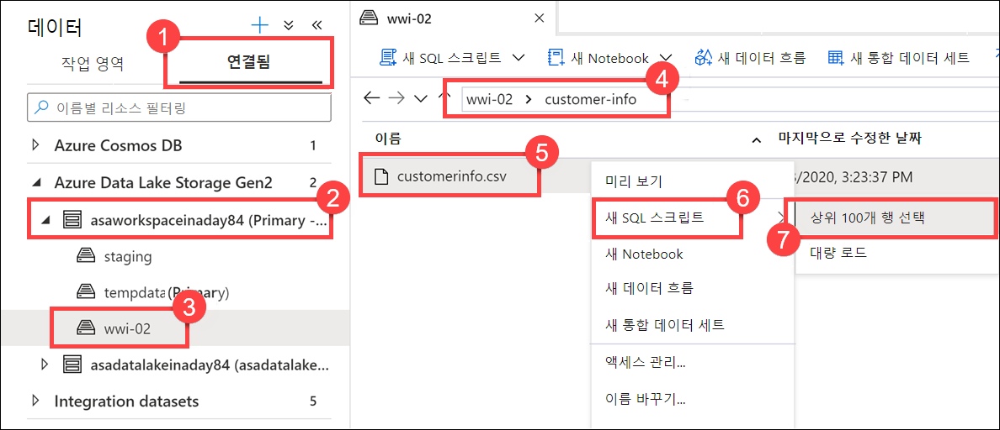

3. **실행**을 선택하여 스크립트를 실행하고, CSV 파일의 첫 번째 행이 열 머리글 행인지 확인합니다. 결과 세트의 열 이름은 **C1**, **C2** 등입니다.

    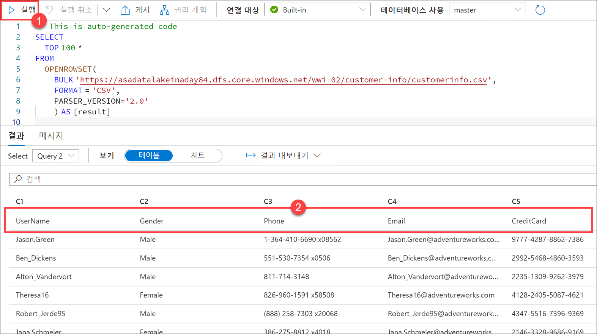

4. 다음 코드를 사용하여 스크립트를 업데이트하고, OPENROWSET BULK의 **SUFFIX**를 고유 리소스 접미사로 바꿉니다.

    ```sql
    CREATE VIEW CustomerInfo AS
        SELECT * 
    FROM OPENROWSET(
            BULK 'https://asadatalakeSUFFIX.dfs.core.windows.net/wwi-02/customer-info/customerinfo.csv',
            FORMAT = 'CSV',
            PARSER_VERSION='2.0',
            FIRSTROW=2
        )
        WITH (
        [UserName] NVARCHAR (50),
        [Gender] NVARCHAR (10),
        [Phone] NVARCHAR (50),
        [Email] NVARCHAR (100),
        [CreditCard] NVARCHAR (50)
        ) AS [r];
        GO

    SELECT * FROM CustomerInfo;
    GO
    ```

    

5. **데이터베이스 사용** 목록에서 **demo**가 여전히 선택되어 있는지 확인한 후에 스크립트를 실행합니다.

    CSV 파일에서 데이터를 선택하는 SQL 쿼리를 래핑할 뷰를 만들었으며, 해당 뷰에서 행을 선택했습니다.

    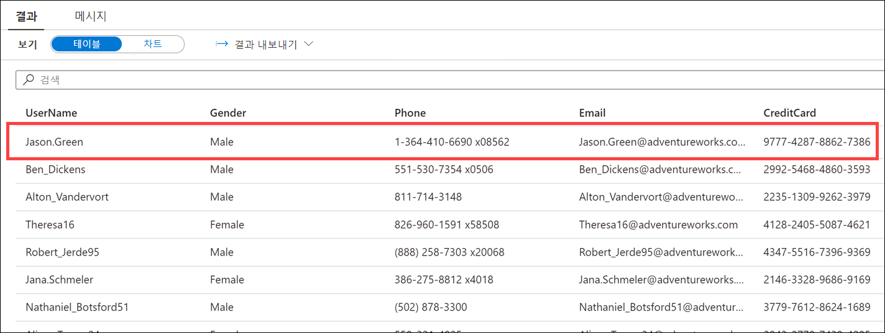

    이번에는 첫 번째 행에 열 머리글이 없습니다. 뷰를 만들 때 OPENROWSET 문에서 FIRSTROW=2 설정을 사용했기 때문입니다.

6. **데이터** 허브 내에서 **작업 영역** 탭을 선택합니다. 그런 다음에 데이터베이스 그룹 오른쪽의 작업 줄임표 **(...)** 를 선택하고 **&#8635; 새로 고침**을 선택합니다.

    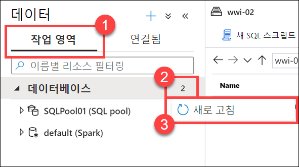

7. **demo** SQL 데이터베이스를 확장합니다.

    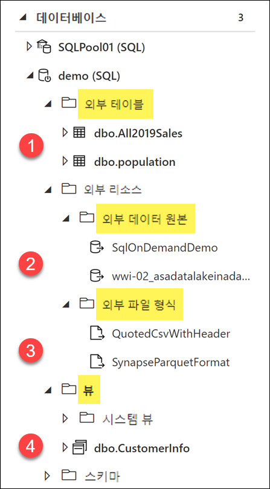

    이 데이터베이스에는 이전 단계에서 만든 아래의 개체가 포함되어 있습니다.

    - **1) 외부 테이블**: *All2019Sales* 및 *population*.
    - **2) 외부 데이터 원본**: *SqlOnDemandDemo* 및 *wwi-02_asadatalakeinadayXXX_dfs_core_windows_net*.
    - **3) 외부 파일 형식**: *QuotedCsvWithHeader* 및 *SynapseParquetFormat*.
    - **4) 뷰**: *CustomerInfo*

## 연습 2 - Azure Synapse Analytics에서 서버리스 SQL 풀을 사용하여 데이터 액세스 보호

Tailwind Traders는 권한이 있는 모든 사용자의 전체 데이터 쿼리를 허용하는 동시에, 영업 데이터를 작성한 연도에만 데이터를 수정할 수 있도록 하는 규칙을 적용하려고 합니다. 필요 시에는 소수의 관리자가 기록 데이터를 수정할 수 있습니다.

- 이렇게 하려면 AAD에 **tailwind-history-owners** 등의 보안 그룹을 만든 후 해당 그룹 소속의 모든 사용자에게 작년의 데이터 수정 권한을 부여해야 합니다.
- 그리고 데이터 레이크가 포함된 Azure Storage 계정의 Azure Storage 기본 제공 RBAC 역할 **Storage Blob 데이터 소유자**에게 **tailwind-history-owners** 보안 그룹을 할당해야 합니다. 그러면 이 역할에 추가된 AAD 사용자와 보안 주체가 작년의 모든 데이터를 수정할 수 있게 됩니다.
- 즉, 모든 기록 데이터 수정 권한이 있는 사용자 보안 주체를 **tailwind-history-owners** 보안 그룹에 추가해야 합니다.
- 그리고 AAD에 **tailwind-readers** 등의 추가 보안 그룹을 만든 후 해당 그룹 소속의 모든 사용자에게 모든 기록 데이터를 비롯한 파일 시스템(여기서는 **prod**)의 모든 콘텐츠 읽기 권한을 부여해야 합니다.
- 그리고 데이터 레이크가 포함된 Azure Storage 계정의 Azure Storage 기본 제공 RBAC 역할 **Storage Blob 데이터 읽기 권한자**에게 **tailwind-readers** 보안 그룹을 할당해야 합니다. 그러면 이 역할에 추가된 AAD 사용자와 보안 주체가 파일 시스템의 모든 데이터를 읽을 수는 있지만 수정할 수는 없게 됩니다.
- 그리고 Tailwind Traders는 AAD에 **tailwind-2020-writers** 등의 또 다른 보안 그룹을 만든 후 해당 그룹 소속의 모든 사용자에게 2020년의 데이터만 수정할 수 있는 권한을 부여해야 합니다.
- 또한 **tailwind-current-writers** 등의 보안 그룹을 추가로 만들어 보안 그룹만 추가해야 합니다. 이 그룹에는 현재 연도의 데이터만 수정할 수 있는 권한(ACL을 사용하여 설정됨)이 부여됩니다.
- 그런 후에는 **tailwind-current-writers** 보안 그룹에 **tailwind-readers** 보안 그룹을 추가해야 합니다.
- 2020년이 되면 Tailwind Traders는 **tailwind-2020-writers** 보안 그룹에 **tailwind-current-writers**를 추가해야 합니다.
- 그리고 **2020** 폴더에서 **tailwind-2020-writers** 보안 그룹의 읽기, 쓰기, 실행 ACL 권한을 설정해야 합니다.
- 2021년이 되면 Tailwind Traders는 2020년 데이터에 대한 쓰기 권한 철회를 위해 **tailwind-2020-writers** 그룹에서 **tailwind-current-writers** 보안 그룹을 제거해야 합니다. 이 경우 **tailwind-readers**의 구성원은 파일 시스템 콘텐츠를 계속 읽을 수는 있습니다. 파일 시스템 수준에서 ACL이 아닌 RBAC 기본 제공 역할을 통해 읽기 및 실행(나열) 권한을 부여받았기 때문입니다.
- 이러한 방식에서는 현재 ACL을 변경해도 권한은 상속되지 않습니다. 그러므로 쓰기 권한을 제거하려면 모든 콘텐츠에서 반복 실행되어 각 폴더 및 파일 개체에서 권한을 제거하는 코드를 작성해야 합니다.
- 이 방식을 사용하면 비교적 빠르게 권한을 할당 및 제거할 수 있습니다. 보호 중인 데이터의 양에 관계없이 RBAC 역할 할당을 전파하려면 최대 5분이 걸릴 수 있습니다.

### 작업 1: Azure Active Directory 보안 그룹 만들기

이 세그먼트에서는 위의 설명에 따라 보안 그룹을 만듭니다. 하지만 데이터 집합에는 2019년까지의 데이터밖에 포함되어 있지 않으므로 2021년이 아닌 **tailwind-2019-writers** 그룹을 만듭니다.

1. Synapse Studio를 열어 두고 다른 브라우저 탭에서 Azure Portal(<https://portal.azure.com>)로 다시 전환합니다.

2. **홈** 페이지에서 포털 메뉴가 아직 확장되지 않았으면 확장한 후에 **Azure Active Directory**를 선택합니다.

    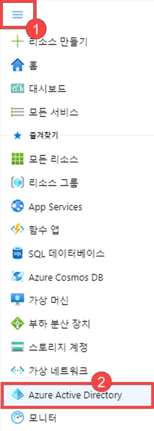

3. 왼쪽 메뉴에서 **그룹**을 선택합니다.

    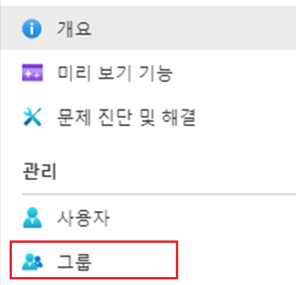

4. **+ 새 그룹**을 선택합니다.

5. **보안** 그룹 유형이 선택되었는지 확인하고, **그룹 이름**으로 `tailwind-history-owners-SUFFIX`(여기서 *suffix*는 고유 리소스 접미사)를 입력한 후에 **만들기**를 선택합니다.

    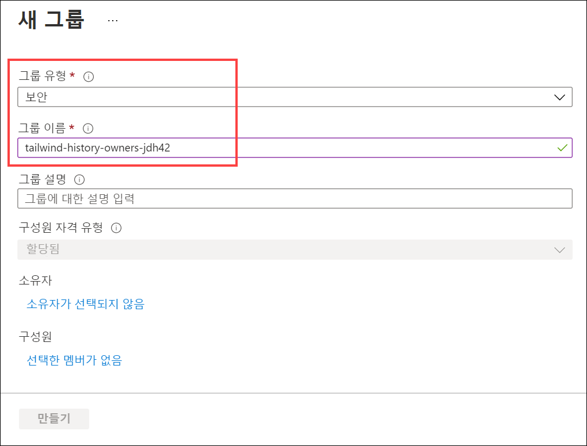

6. `tailwind-readers-SUFFIX`(여기서 *SUFFIX*는 고유 리소스 접미사)라는 두 번째 새 보안 그룹을 추가합니다.
7. `tailwind-current-writers-SUFFIX`(여기서 *SUFFIX*는 고유 리소스 접미사)라는 세 번째 보안 그룹을 추가합니다.
8. `tailwind-2019-writers-SUFFIX`(여기서 *SUFFIX*는 고유 리소스 접미사)라는 네 번째 보안 그룹을 추가합니다.

> **참고**: 이 연습의 나머지 지침에서는 명확성을 위해 역할 이름에서 *-SUFFIX* 부분을 생략하겠습니다. 본인의 고유 리소스 접미사를 기반으로 고유하게 식별되는 역할 이름을 사용해야 합니다.

### 작업 2: 그룹 구성원 추가

이번에는 권한 테스트를 위해 그룹에 사용자의 계정을 추가해 보겠습니다.

1. 새로 만든 **tailwind-readers** 그룹을 엽니다.

2. 왼쪽에서 **구성원**을 선택하고 **+ 구성원 추가**를 선택합니다.

    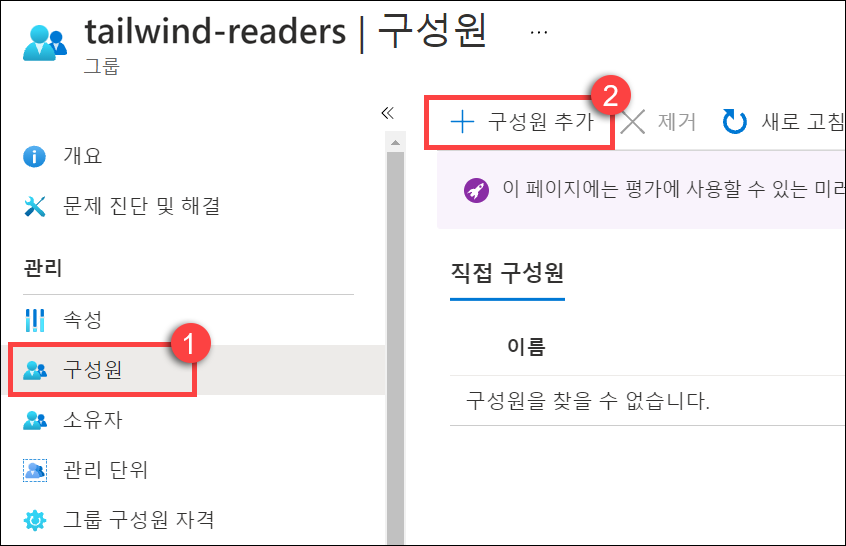

3. 랩 진행을 위해 로그인한 사용자 계정을 검색하고 **선택**을 선택합니다.

4. **tailwind-2019-writers** 그룹을 엽니다.

5. 왼쪽에서 **구성원**을 선택하고 **+ 구성원 추가**를 선택합니다.

6. `tailwind`를 검색하여 **tailwind-current-writers** 그룹을 선택하고 **선택**을 선택합니다.

    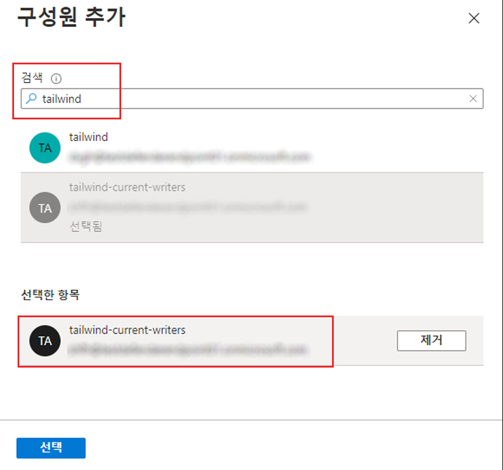

7. 왼쪽 메뉴에서 **개요**를 선택하고 **개체 ID**를 **복사**합니다.

    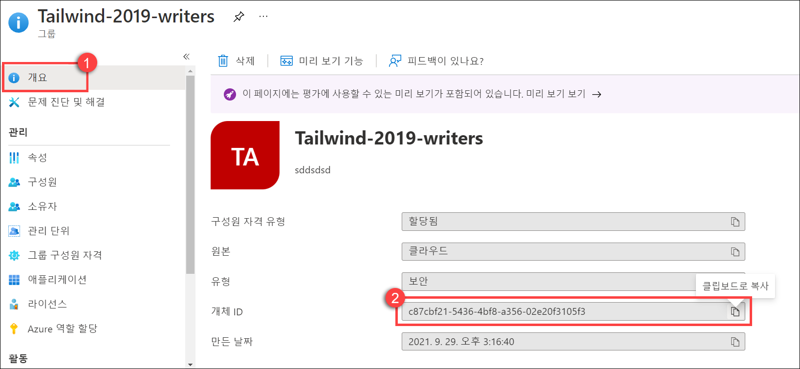

    > **참고**: **개체 ID** 값을 메모장 또는 유사한 텍스트 편집기에 저장합니다. 이후 단계에서 스토리지 계정에 액세스 제어를 할당할 때 이 ID를 사용합니다.

### 작업 3: 데이터 레이크 보안 구성 - RBAC(역할 기반 액세스 제어)

1. Azure Portal에서 **data-engineering-synapse-*xxxxxxx*** 리소스 그룹을 엽니다.

2. **asadatalake*xxxxxxx*** 스토리지 계정을 엽니다.

    

3. 왼쪽 메뉴에서 **액세스 제어(IAM)** 를 선택합니다.

    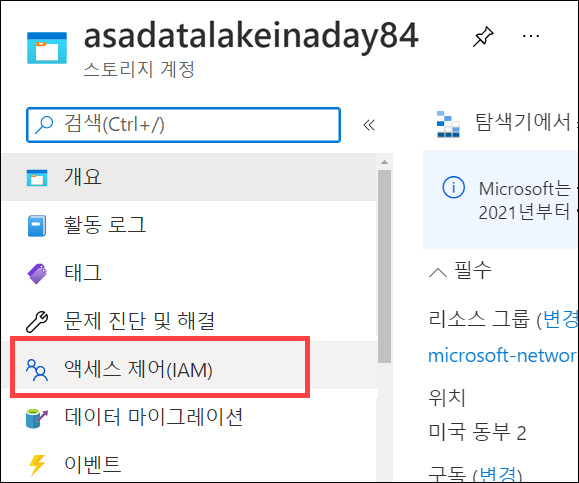

4. **역할 할당** 탭을 선택합니다.

    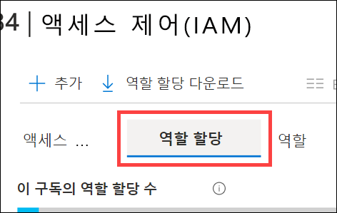

5. **+ 추가**, **역할 할당 추가**를 차례로 선택합니다.

    

6. **역할** 화면에서 **Storage Blob 데이터 읽기 권한자**를 선택한 후에 **다음**을 클릭합니다. **구성원** 화면에서 **+ 구성원 선택**을 클릭한 후에 `tailwind-readers`를 검색하고 결과에서 **tailwind-readers** 그룹을 선택합니다. 그런 다음, **선택**을 클릭합니다. 그런 다음 **검토 + 할당**을 클릭하고, **검토 + 할당**을 다시 한 번 클릭합니다.

    이 그룹에 사용자 계정을 추가했으므로 이 계정의 Blob 컨테이너에 있는 모든 파일에 대한 읽기 권한이 부여되었습니다. Tailwind Traders는 **tailwind-readers** 보안 그룹에 모든 사용자를 추가해야 합니다.

7. **+ 추가**, **역할 할당 추가**를 차례로 선택합니다.

    

8. **역할**의 경우, **Storage Blob 데이터 읽기 권한자**를 검색한 후에 **다음**을 선택합니다.

9. **구성원** 화면에서 **+ 구성원 선택**을 클릭한 후에 `tailwind`를 검색하고 결과에서 **tailwind-history-owners** 그룹을 선택합니다. 그런 다음 **검토 + 할당**을 클릭하고, **검토 + 할당**을 다시 클릭합니다.

    이제, 데이터 레이크가 포함된 Azure Storage 계정의 Azure Storage 기본 제공 RBAC 역할 **Storage Blob 데이터 소유자**에게 **tailwind-history-owners** 보안 그룹이 할당됩니다. 따라서 이 역할에 추가된 Azure AD 사용자와 보안 주체가 작년의 모든 데이터를 수정할 수 있습니다.

    Tailwind Traders는 모든 기록 데이터 수정 권한이 있는 사용자 보안 주체를 **tailwind-history-owners** 보안 그룹에 추가해야 합니다.

10. 스토리지 계정의 **액세스 제어(IAM)** 목록에서 **Storage Blob 데이터 소유자 역할** 아래에 표시된 사용자의 Azure 사용자 계정을 선택한 다음 **제거**를 선택합니다.

    **tailwind-history-owners** 그룹은 **Storage Blob 데이터 소유자 그룹**에 할당되었으며 **tailwind-readers**는 **Storage Blob 데이터 읽기 권한자** 그룹에 할당되었습니다.

    > **참고**: 모든 새 역할 할당을 확인하려면 리소스 그룹으로 다시 이동했다가 이 화면으로 돌아와야 할 수도 있습니다.

### 작업 4: 데이터 레이크 보안 구성 - ACL(액세스 제어 목록)

1. 왼쪽 메뉴에서 **저장소 브라우저(미리 보기)** 를 선택합니다. **Blob 컨테이너**를 확장하고 **wwi-02** 컨테이너를 선택합니다. **sale-small** 폴더를 열고 **Year=2019** 폴더를 마우스 오른쪽 단추로 클릭한 다음 **ACL 관리**를 선택합니다.

    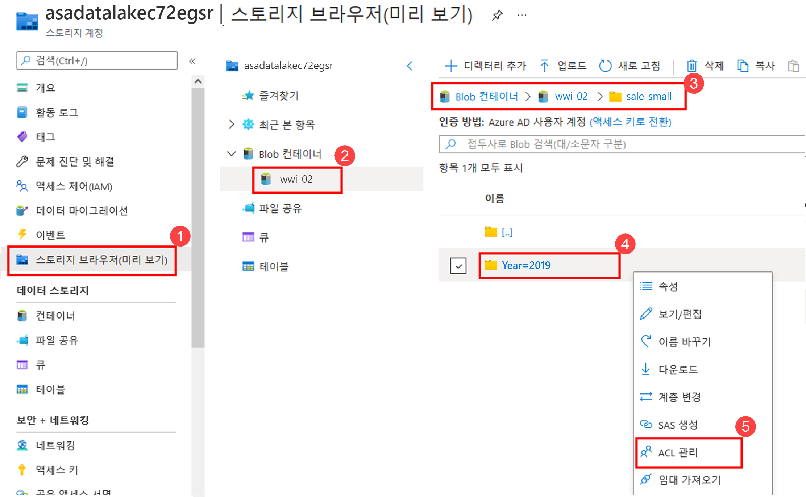

2. ACL 관리 화면의 **액세스 권한** 화면에서 **+ 주체 추가**를 클릭하고, **tailwind-2019-writers** 보안 그룹에서 복사한 **개체 ID** 값을 **주체 추가** 검색 상자에 붙여넣고, **tailwind-2019-writers-suffix**를 클릭한 후에 **선택**을 선택합니다.

3. 이제 액세스 관리 대화 상자에서 **tailwind-2019-writers** 그룹이 선택됩니다. **읽기**, **쓰기** 및 **실행** 체크박스를 선택한 후에 **저장**을 선택합니다.

4. ACL 관리 화면의 **기본 권한** 화면에서 **+ 주체 추가**를 클릭하고, **tailwind-2019-writers** 보안 그룹에서 복사한 **개체 ID** 값을 **주체 추가** 검색 상자에 붙여넣고, **tailwind-2019-writers-suffix**를 클릭한 후에 **선택**을 선택합니다.

    **tailwind-current** 보안 그룹에 추가되는 모든 사용자가 **tailwind-2019-writers** 그룹을 통해 **Year=2019** 폴더에 데이터를 쓸 수 있도록 허용하는 보안 ACL이 설정되었습니다. 이러한 사용자는 현재(여기서는 2019년) 영업 파일만 관리할 수 있습니다.

    다음 해가 시작되면 2019년 데이터에 대한 쓰기 권한 철회를 위해 **tailwind-2019-writers** 그룹에서 **tailwind-current-writers** 보안 그룹을 제거해야 합니다. 이 경우 **tailwind-readers**의 구성원은 파일 시스템 콘텐츠를 계속 읽을 수는 있습니다. 파일 시스템 수준에서 ACL이 아닌 RBAC 기본 제공 역할을 통해 읽기 및 실행(나열) 권한을 부여받았기 때문입니다.

    이 구성에서는 _액세스_ ACL과 _기본_ ACL을 모두 구성했습니다.

    *액세스* ACL은 개체에 대한 액세스를 제어합니다. 파일과 디렉터리 모두에 액세스 ACL이 있습니다.

    *기본* ACL은 디렉터리에 생성된 모든 자식 항목의 액세스 ACL을 결정하는 디렉터리와 연결된 ACL 템플릿입니다. 파일에는 기본 ACL이 없습니다.

    액세스 ACL 및 기본 ACL의 구조는 모두 동일합니다.

### 작업 5: 권한 테스트

1. Synapse Studio, **데이터** 허브의 **연결됨** 탭에서 **Azure Data Lake Storage Gen2/asaworkspace*xxxxxxx*/wwi02** 컨테이너를 선택합니다. 그리고 *sale-small/Year=2019/Quarter=Q4/Month=12/Day=20191231* 폴더에서 **sale-small-20191231-snappy.parquet file**을 마우스 오른쪽 단추로 클릭하고, **새 SQL 스크립트**를 선택하고, **상위 100개 행 선택**을 선택합니다.

    

2. 쿼리 창 위쪽의 **연결 대상** 드롭다운 목록에서 **기본 제공**이 선택되어 있는지 확인하고 쿼리를 실행합니다. 서버리스 SQL 풀 엔드포인트에서 데이터가 로드되어 일반 관계형 데이터베이스의 데이터처럼 처리됩니다.

    

    셀 출력에 Parquet 파일의 쿼리 결과가 표시됩니다.

    

    **tailwind-readers** 보안 그룹을 통해 Parquet 파일 읽기 권한이 할당되었으므로 파일 내용을 확인할 수 있습니다. 이 그룹에는 **Storage Blob 데이터 읽기 권한자** 역할이 할당되며, 따라서 스토리지 계정에 대한 RBAC 권한이 부여됩니다.

    그런데 여기서는 **Storage Blob 데이터 소유자** 역할에서 사용자 계정을 제거한 후 **tailwind-history-owners** 보안 그룹에 추가하지 않았습니다. 이 상태에서 이 디렉터리에 쓰기를 시도하는 경우의

    결과를 확인해 보겠습니다.

3. **wwi-02** 창에서 **sale-small-20191231-snappy.parquet** 파일을 마우스 오른쪽 단추로 클릭하고, **새 Notebook**을 선택한 후에 **데이터 프레임에 로드**를 선택합니다.

    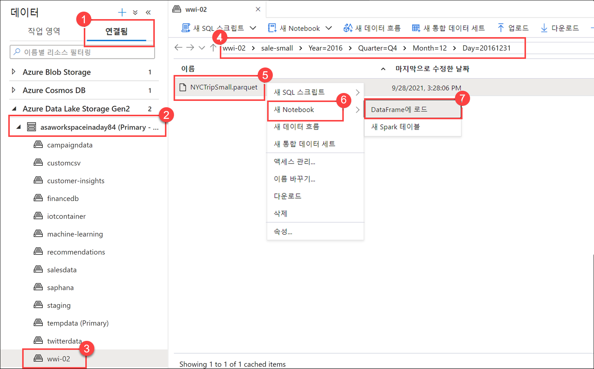

4. Notebook에 **SparkPool01** Spark 풀을 연결합니다.

    

5. Notebook에서 셀을 실행하여 데이터 프레임에 데이터를 로드합니다. 이것은 Spark 풀이 시작되기 때문에 시간이 좀 걸릴 수 있지만, 결국에는 데이터의 처음 10개 행이 표시됩니다. 이를 통해 이 위치에서 데이터를 읽을 수 있는 권한이 있음을 다시 한 번 확인할 수 있습니다.

6. 결과 아래에서 **+ 코드**를 선택하여 기존 셀 아래에 코드 셀을 추가합니다.

7. 다음 코드를 입력합니다. 이때 *SUFFIX*를 데이터 레이크 리소스의 고유 접미사로 바꿉니다(위의 셀 1에서 복사할 수 있음).

    ```python
    df.write.parquet('abfss://wwi-02@asadatalakeSUFFIX.dfs.core.windows.net/sale-small/Year=2019/Quarter=Q4/Month=12/Day=20191231/sale-small-20191231-snappy-test.parquet')
    ```

8. 방금 추가한 새 셀을 실행합니다. 출력에 **403 오류**가 표시됩니다.

    

    즉, 쓰기 권한이 없는 것입니다. 셀 2에서 반환되는 오류는 *This request is not authorized to perform this operation using this permission.* 이며 상태 코드는 403입니다.

9. Notebook을 게시하고 세션을 종료합니다. 그런 다음에 Azure Synapse Studio에서 로그아웃하고 브라우저 탭을 닫아서 Azure Portal 탭(<https://portal.azure.com>)으로 돌아갑니다.

10. 포털 메뉴의 **홈** 페이지에서 **Azure Active Directory**를 선택합니다.

11. 왼쪽 메뉴에서 **그룹**을 선택합니다.

12. 검색 상자에 `tailwind`를 입력하고 결과에서 **tailwind-history-owners**를 선택합니다.

13. 왼쪽에서 **구성원**을 선택하고 **+ 구성원 추가**를 선택합니다.

14. 랩 진행을 위해 로그인한 사용자 계정을 추가하고 **선택**을 선택합니다.

15. 새 탭에서 Azure Synapse Studio(<https://web.azuresynapse.net/>)로 이동합니다. 그런 다음에 **개발** 탭에서 **Notebooks**를 확장하고 앞서 게시한 Notebook을 다시 엽니다.

16. **모두 실행**을 클릭하여 Notebook에서 모든 셀을 다시 실행합니다. 잠시 후에 Spark 세션이 시작되고 코드가 실행됩니다. 셀 2는 **성공** 상태를 반환합니다. 이는 새 파일이 데이터 레이크 저장소에 작성되었음을 의미합니다.

    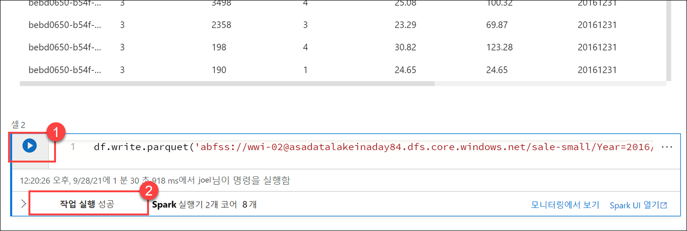

    **tailwind-history-owners** 그룹에 사용자 계정을 추가했으므로 이번에는 셀 2가 정상적으로 실행되었습니다. 즉, 계정에 **Storage Blob 데이터 소유자** 역할이 할당된 것입니다.

    > **참고**: 이번에도 같은 오류가 발생하면 Notebook에서 **Spart 세션을 중지**하고 **모두 게시**, 게시를 차례로 선택합니다. 변경 내용을 게시한 후 페이지 오른쪽 위의 사용자 프로필을 선택하고 **로그아웃**을 선택합니다. 정상적으로 로그아웃되면 **브라우저 탭을 닫고** Synapse Studio(<https://web.azuresynapse.net/>)를 다시 시작한 후 Notebook을 다시 열고 셀을 다시 실행합니다. 인증 변경 내용이 적용되려면 보안 토큰을 새로 고쳐야 하기 때문입니다.

17. Notebook의 오른쪽 상단에서 **세션 중지** 단추를 사용하여 Notebook 세션을 중지합니다.

18. 변경 사항을 저장하려면 Notebook을 게시합니다. 그런 다음에 닫습니다.

    이제 데이터 레이크에 파일이 작성되었는지 확인해 보겠습니다.

19. Synapse Studio, **데이터** 허브의 **연결됨** 탭에서 **Azure Data Lake Storage Gen2/asaworkspace*xxxxxxx*/wwi02** 컨테이너를 선택합니다. 그리고 *sale-small/Year=2019/Quarter=Q4/Month=12/Day=20191231* 폴더로 이동하여 이 폴더에 새 파일이 추가되었는지 확인합니다.

    
